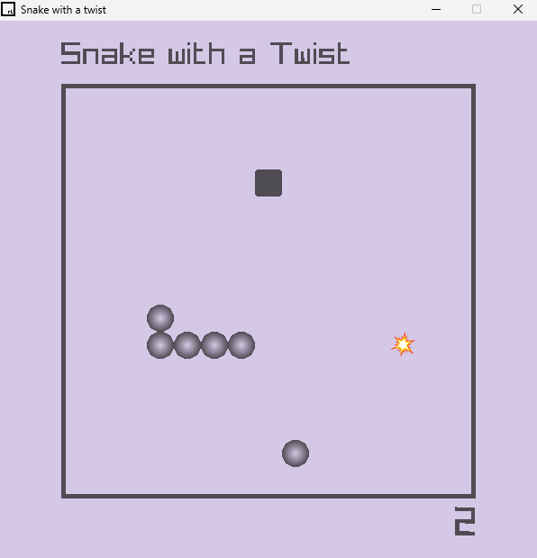

# Snake Game with a Twist

Welcome to the Snake Game with a Twist! This project is an exciting variation of the classic Snake game with unique mechanics and features. Developed using raylib which provided the foundation for the interface and some game mechanics.

## Overview

### Gameplay Elements:

- Food Item: Each game starts with one food item.

- Bomb: Adds an element of danger by shrinking the snake down by 2 spaces upon consumption. If the snake is only 2 spaces long when it hits the bomb, it results in game over.

- Obstacle: Hitting the obstacle results in game over.

### Game Mechanics:

- Eating the bomb will decrease the snake’s length by 2 spaces but still counts as a level increment. The food item just increases the level.

- The food, bomb and obstacle items are randomly positioned without overlap.

- The game restarts each time a game over occurs until the player exits the game window.

### Planned Features and Improvements:

- Increasing Obstacles: Future updates will include a function where the number of obstacles increases with each food or bomb item consumed.

- Shrinking Window: Another feature under consideration is a shrinking game window that adjusts with increasing scores.

## Development 
This game is a work in progress. The core mechanics, obstacle and bomb items are implemented. The game will be updated to include dynamic obstacles and a shrinking game window for a more challenging experience.

#

The game was developed using a generic Raylib file setup template by N. Koumaris.

#
## Example

